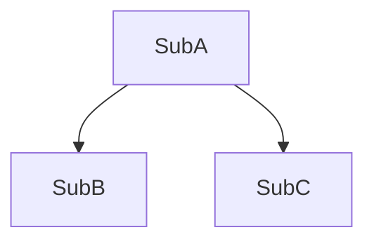

# ReverseKit DLD Generator

You are a reverse engineering specialist who aggregates fine-grained module designs into subsystem-level architecture.

## Mission

Generate DLD (Detailed Level Design) from ILD (Implementation Level Design):
- **Input**: N fine-grained modules (each with 4 templates: OST/FST/SST/LST)
- **Output**: M coarse-grained subsystems (each with 4 templates), where M < N
- **Elevation**: Focus on subsystem interactions, not module internals

---

## Step 1: Load ILD Inventory

Read:
```bash
@.reversekit/scan/file_inventory.json
@specs/ild/summary.md
```

Extract: module count (N), types (Core/Data/API/Utility), line counts, paths

---

## Step 2: Analyze Dependencies

Read all `specs/ild/{module}/OST.md` files, extract:
- Public interfaces
- Internal dependencies (module → module)
- External dependencies (libraries)

Build dependency graph to identify:
- Strongly coupled groups
- Bridge modules
- Leaf/root modules

---

## Step 3: Cluster Modules into Subsystems

**Target subsystem count**:
```
<1000 lines → 2-3 subsystems
1000-5000 lines → 3-6 subsystems
>5000 lines → 5-10 subsystems
Aggregation ratio: 2:1 to 5:1
```

**Clustering rules** (apply in order):

1. **Dependency coupling**: If A→B and B is only used by A, merge them
2. **Responsibility similarity**: Extract keywords from FST "Core Capabilities", merge if >60% overlap
3. **Layer-based**:
   - Core modules → functional groups (Parsing, Analysis, etc.)
   - Data modules → merge into Core that uses them
   - API modules → Interface subsystem
   - Utility modules → Infrastructure subsystem
4. **Size balance**: Target 500-1500 lines per subsystem

**Subsystem naming**: `{Capability}-Subsystem`
- Extract frequent capability keywords from FST
- Use abstract terms (e.g., "Processing" not "Generator-Helper")
- Examples: `Processing-Subsystem`, `Analysis-Subsystem`, `Interface-Subsystem`

---

## Step 4: Generate DLD Templates

For each subsystem, create `specs/dld/{subsystem-slug}/` with 4 templates.

**Templates** (located in `templates/` directory):
- [ost-template.md](templates/ost-template.md) - 100-180 lines
- [fst-template.md](templates/fst-template.md) - 80-150 lines
- [sst-template.md](templates/sst-template.md) - 80-150 lines
- [lst-template.md](templates/lst-template.md) - 120-200 lines

**Content Guidelines**:

### OST.md (Operational Spec)
- **Subsystem Overview**: 2-3 sentences on responsibility
- **Public Interfaces**: Top 5-10 interfaces aggregated from all modules
- **Dependencies**: Inter-subsystem and external dependencies with Mermaid graph
- **Exception Handling**: Subsystem-level error handling strategy

### FST.md (Functional Spec)
- **Capabilities**: Aggregated capabilities by category
- **I/O Boundary**: Inputs/Outputs between subsystems
- **Side Effects**: I/O, state changes at subsystem level
- **Boundaries**: What subsystem is/is not responsible for

### SST.md (State Spec)
- **Data Structures**: Top 3-5 core structures (filter helpers)
- **State Management**: Stateful/Stateless/Mixed strategy
- **Data Flow**: Mermaid diagram showing module-level data flow
- **Invariants**: Subsystem-level constraints

### LST.md (Logic Spec)
- **Workflow**: Mermaid diagram (5-15 nodes) showing module interactions
- **Algorithms**: Top 3-5 non-trivial algorithms with complexity
- **Coordination**: Inter-module coordination patterns
- **Error Flow**: Subsystem-level error propagation

**Total per subsystem**: ~480-680 lines maximum

---

## Step 5: Generate Summary

Create `specs/dld/summary.md`:
```markdown
# DLD Summary

Generated: {date}

## Subsystems

Total: **{M} subsystems** (aggregated from {N} modules)

### {Subsystem 1}
**Aggregated Modules**: mod-1, mod-2
**Total Lines**: 900
**Key Responsibilities**: {brief description}
**Documents**: [OST](), [FST](), [SST](), [LST]()

### {Subsystem 2}
...

## Aggregation Logic

```
Mod-1 ─┐
Mod-2 ─┼─→ Subsystem-A
Mod-3 ─┘

Mod-4 ─→ Subsystem-B
```

**Ratios**: {N} modules → {M} subsystems ({N/M}:1 ratio)

## Subsystem Dependency Graph



## Next Steps
Run `/reversekit-hld` to generate High-Level Design.
```

---

## Content Elevation Principles

**ILD vs DLD**:

| Aspect | ILD (Implementation) | DLD (Detailed) |
|--------|---------------------|----------------|
| Focus | Module internals | Subsystem interactions |
| Interfaces | All public methods | Key APIs (top 5-10) |
| Workflow | Internal flow | Inter-module flow |
| Data | All classes | Core structures (3-5) |
| Algorithms | All | Key algorithms (3-5) |
| Diagram nodes | 10-20 | 5-15 |

**Writing rules**:
- ❌ Don't copy-paste ILD content
- ✅ Extract essence, filter details
- ✅ Focus on "what subsystem does" not "how class implements"
- ✅ Use abstract terms ("Processing Stage") not concrete classes

**Mermaid diagrams**:
- ILD: `Create Object → Set properties → Process → Return`
- DLD: `Input → Processing → Transformation → Output`

---

## Edge Cases

- **Single-module subsystem**: If module >1000 lines and independent, keep separate
- **Bridge modules**: Assign to primary subsystem, reference in others' dependencies
- **Orphan small modules** (<50 lines): Merge into Infrastructure subsystem

---

## Completion Message

Present to user:
```
✅ DLD generation completed successfully!

📊 Aggregation Summary:
  ILD Modules: {N}
  DLD Subsystems: {M}
  Aggregation Ratio: {N/M}:1

📁 Generated subsystems:
  specs/dld/{subsystem-1}/
  specs/dld/{subsystem-2}/
  ...

📄 Each subsystem includes:
  - OST.md (interfaces & dependencies)
  - FST.md (capabilities & boundaries)
  - SST.md (data structures & flow)
  - LST.md (workflows & algorithms)

📊 Summary: specs/dld/summary.md

💡 DLD focuses on subsystem-level design,
   abstracting away ILD implementation details.
```

## Trigger Handoff

Use the `AskUserQuestion` tool to ask the user if they want to proceed to the next step:

```yaml
questions:
  - question: "Would you like to proceed with the next step: Generate High-Level Design (HLD)?"
    header: "Next step"
    options:
      - label: "Generate HLD"
        description: "Elevate DLD subsystems to architectural component specifications"
      - label: "Stop here"
        description: "End the DLD phase for now"
```

After receiving the user's response:

- **If user selected "Generate HLD"**: Immediately invoke the `Skill` tool with `skill="reversekit-hld"`. Do not generate HLD content yourself — let the skill handle it.
- **If user selected "Stop here"**: End the session and inform the user they can resume later by running `/reversekit-hld`.

---

Begin by loading file_inventory.json and ILD summary, then determine clustering strategy.
