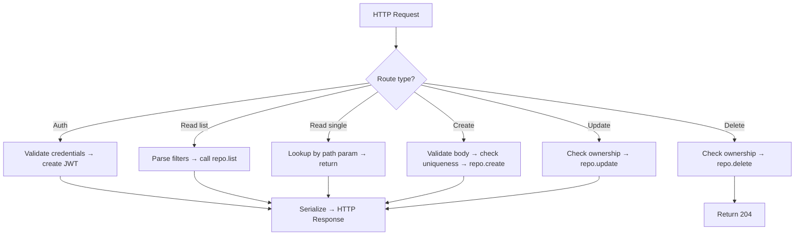

# LST - Logic Specification: API Interface Subsystem

## Main Workflow



## Key Algorithms

### Authentication Pipeline
Extracts `Authorization: Token <jwt>` header → splits on space → validates prefix matches `settings.jwt_token_prefix` → decodes JWT with secret key → extracts username → looks up user by username → returns User or raises 403. Two variants: required (raises 401 if missing) and optional (returns None if missing).

### Entity Resolution Pipeline
Path parameter (slug, username, comment_id) → calls repository lookup → if found, returns domain model → if `EntityDoesNotExist`, raises HTTPException 404 with localized error string. Used as a dependency to preload entities before route handler execution.

### Permission Guard Pattern
Pre-loaded entity + current user → checks authorship equality (`entity.author.username == user.username`) → if not match, raises HTTPException 403. Applied as a `dependencies=` parameter on PUT/DELETE routes.

## Coordination

### Dependency Injection Chain
Routes declare dependencies via FastAPI's `Depends()`:
1. **Auth** → `get_current_user_authorizer()` → extracts JWT → returns User
2. **DB** → `get_repository(RepoType)` → acquires connection → returns repository
3. **Lookup** → `get_article_by_slug_from_path()` → queries DB → returns Article
4. **Permission** → `check_article_modification_permissions` → verifies ownership

These are executed in dependency order before the route handler runs.

### Route Composition
- `api.py` aggregates all sub-routers with appropriate prefixes
- Article routes split into two files: resource CRUD (`articles_resource.py`) and common operations (`articles_common.py` for feed/favorites)
- Comments router mounted with nested prefix `/articles/{slug}/comments`

### Error Handling Strategy
- **Validation errors**: Handled by FastAPI's default 422 handler, overridden by custom `http422_error_handler`
- **HTTP errors**: Caught by custom `http_error_handler` for consistent response format
- **Business errors**: Routes raise `HTTPException` with appropriate status code and string resource key

## Error Flow

```
HTTP Request → Auth dependency
  → Missing header → 401 (if required) / None (if optional)
  → Invalid JWT → 403 (malformed payload)
  → Valid JWT → User resolved

  → Entity lookup dependency
    → Not found → 404 (entity does not exist)
    → Found → Entity resolved

  → Permission check (if applicable)
    → Not owner → 403
    → Owner → Proceed

  → Route handler → Repository call
    → Business error (duplicate, already favorited) → 400
    → Success → Serialize → HTTP Response
```

- Errors are caught at the level where they can be handled with appropriate context
- Subsystem-level: Auth failures, 404s, permission denials
- Route-level: Business rule violations (duplicates, invalid state transitions)
- All error messages centralized in `app.resources.strings`
