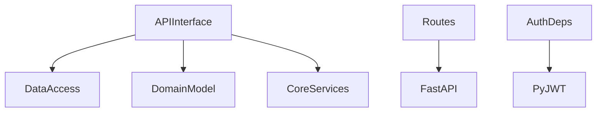

# OST - Operational Specification: API Interface Subsystem

## Overview

The API Interface subsystem exposes the RealWorld REST API. It handles HTTP routing, request validation, authentication, authorization, and response formatting. The subsystem combines route definitions with dependency injection providers for authentication, database connections, and entity lookups.

## Public Interfaces

### Route Endpoints
- **Authentication**: `POST /api/users/login` (login), `POST /api/users` (register)
- **Users**: `GET /api/user` (get current), `PUT /api/user` (update current)
- **Profiles**: `GET /api/profiles/{username}`, `POST/DELETE /api/profiles/{username}/follow`
- **Articles**: `GET/POST /api/articles`, `GET/PUT/DELETE /api/articles/{slug}`
- **Article Feed/Favorites**: `GET /api/articles/feed`, `POST/DELETE /api/articles/{slug}/favorite`
- **Comments**: `GET/POST /api/articles/{slug}/comments`, `DELETE /api/articles/{slug}/comments/{id}`
- **Tags**: `GET /api/tags`

### Dependency Providers
- **get_current_user_authorizer(required)** - Factory returning auth dependency (required or optional)
- **get_repository(RepoType)** - Factory creating repository instances with pooled DB connection
- **get_article_by_slug_from_path** - Resolves slug path param to Article domain model (404 if missing)
- **get_comment_by_id_from_path** - Resolves comment ID to Comment model (404 if missing)
- **get_profile_by_username_from_path** - Resolves username to Profile (404 if missing)
- **check_article_modification_permissions** - Verifies authorship, raises 403 if not owner
- **check_comment_modification_permissions** - Verifies comment authorship

### Route Aggregator
- **api.py** - Central router mounting all sub-routers under `/api` prefix

## Dependencies

### Inter-Subsystem
- **Data Access** - All repositories for CRUD operations
- **Domain Model** - Schema models for request/response validation, domain models for internal representation
- **Core Services** - JWT token creation, slug generation, existence checks, password hashing

### External Dependencies

## Exception Handling

- **HTTPException 401/403** - Missing, invalid, or malformed authentication token
- **HTTPException 404** - Entity not found (article, comment, profile)
- **HTTPException 400** - Validation errors (duplicate username/email, self-follow, duplicate favorite)
- **HTTPException 422** - Pydantic validation errors (malformed request body)
- Error messages sourced from centralized `app.resources.strings`

## Preconditions & Postconditions

**Preconditions**:
- FastAPI app initialized with settings
- Database connection pool active (`app.state.pool`)
- All routes mounted under configured `api_prefix`

**Postconditions**:
- Successful responses follow RealWorld spec: wrapped objects (`{user: {...}}`, `{article: {...}}`)
- Write operations return appropriate HTTP status codes (201 created, 204 no content)
- Auth-required endpoints reject unauthenticated requests with 401/403
