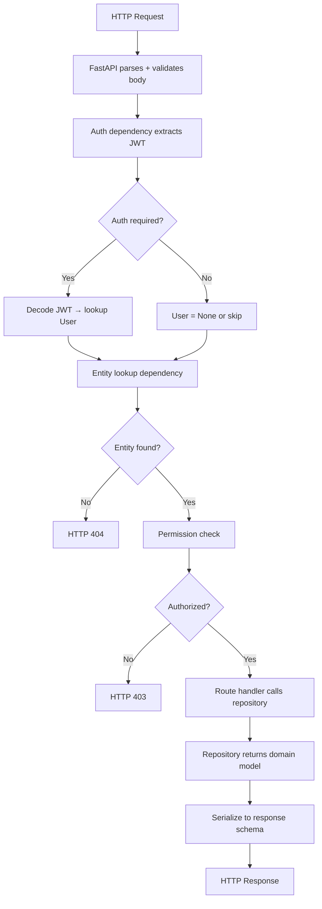

# SST - State Specification: API Interface Subsystem

## Core Data Structures

### Route Structure
All routes are organized as FastAPI `APIRouter` instances:
- **Main router** (`api.py`) - Aggregates sub-routers with prefixes
- **Sub-routers** - Grouped by resource (articles, authentication, users, profiles, comments, tags)

### Dependency Injection Patterns
- **Auth factory**: `get_current_user_authorizer(required=True/False)` returns one of two internal functions
- **Repo factory**: `get_repository(RepoType)` returns a closure that instantiates the repo with an acquired connection
- **Lookup providers**: Async functions that resolve path params to domain models or raise HTTPException

### Request/Response Models
All defined in Domain Model subsystem; this subsystem only references them:
- **Request schemas**: `ArticleInCreate`, `ArticleInUpdate`, `UserInCreate`, `UserInLogin`, `UserInUpdate`, `CommentInCreate`
- **Response schemas**: `ArticleInResponse`, `ListOfArticlesInResponse`, `UserInResponse`, `ProfileInResponse`, `CommentInResponse`, `ListOfCommentsInResponse`, `TagsInList`

## State Management

**Strategy**: Fully stateless
- All route handlers are pure functions of their dependencies
- No instance variables, no shared state between requests
- Authentication state encoded in JWT token (client-side), not server-side session
- Connection lifecycle managed by pool (acquire per-request, return after)

## Data Flow

## Invariants

- **Auth header format**: Must be `Token <jwt>` (not `Bearer`); wrong prefix → 403
- **Route prefix**: All routes mounted under `settings.api_prefix` (default `/api`)
- **Response wrapping**: All responses follow RealWorld spec with top-level key (`{article: ...}`, `{user: ...}`)
- **Status codes**: 200 for reads/updates, 201 for creation, 204 for deletion
- **Ownership rule**: Only the resource author can update or delete (enforced by dependency guard)
- **Idempotent favorites**: Favorite/unfavorite returns 400 if already in that state (checked at route level)
