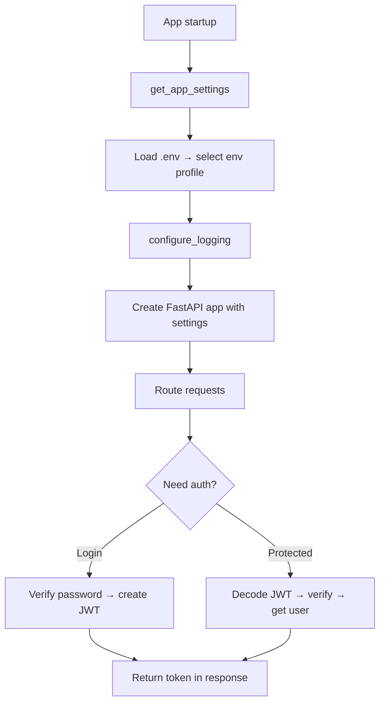

# LST - Logic Specification: Core Services Subsystem

## Main Workflow



## Key Algorithms

### Settings Resolution (O(1))
Creates temporary `BaseAppSettings` to read `app_env` from `.env` → looks up corresponding class in `environments` dict → instantiates → caches via `@lru_cache`. Subsequent calls return cached instance instantly.

### JWT Creation & Decoding (O(1))
**Create**: Copy user dict → add expiration (now + 7 days) and subject → encode with HS256 + secret key → return token string.
**Decode**: Decode token with secret key → validate against `JWTUser` schema → extract username. On decode failure → raise `ValueError`.

### Password Hashing (O(n) bcrypt work factor)
**Hash**: Generate random bcrypt salt → concatenate salt + password → hash via passlib → store both salt and hash.
**Verify**: Concatenate stored salt + input password → verify against stored hash via passlib.

### Existence Check Pattern (O(1) DB lookup)
Try repository lookup → if `EntityDoesNotExist` caught → return `False` → otherwise return `True`. Used for username/email uniqueness during registration and slug uniqueness during article creation.

## Coordination

### Settings → All Subsystems
Settings instance is injected into route handlers and dependencies via `Depends(get_app_settings)`. Provides database URL, secret key, API prefix, and JWT prefix used across all subsystems.

### JWT ↔ Auth Dependency
API Interface's auth dependency calls `services.jwt.get_username_from_token()` to decode the token, then uses the username to look up the user via Data Access repository.

### Security ↔ Domain Model
`UserInDB.change_password()` calls `services.security.generate_salt()` and `get_password_hash()`. `UserInDB.check_password()` calls `verify_password()`.

## Error Flow

```
Settings initialization
  → Missing env var → Pydantic validation error → app fails to start

JWT decoding
  → Malformed token → PyJWT error → ValueError → HTTP 403
  → Valid token, expired → PyJWT error → ValueError → HTTP 403
  → Valid token, wrong key → PyJWT error → ValueError → HTTP 403

Password verification
  → Wrong password → verify_password returns False → HTTP 400
  → Hashing failure → bcrypt exception → propagated upward

Existence checks
  → Entity not found → EntityDoesNotExist → caught → return False
  → DB error → propagated to caller
```

- Service functions rarely catch errors; they propagate to callers
- The existence check pattern is the only deliberate error interception
- JWT decode errors are caught by the auth dependency and converted to HTTP 403
