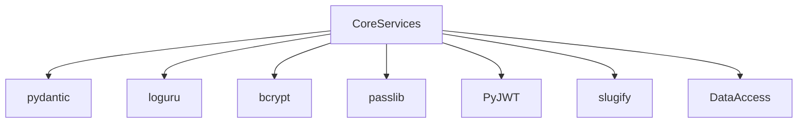

# OST - Operational Specification: Core Services Subsystem

## Overview

The Core Services subsystem provides application-wide infrastructure: environment-specific configuration management, JWT token creation/parsing, password security utilities, and business logic helpers (slug generation, existence checks, ownership verification). It is the foundation that other subsystems depend on for cryptographic operations and runtime configuration.

## Public Interfaces

### Configuration Management
- **get_app_settings()** - LRU-cached factory returning AppSettings subclass based on `APP_ENV`
- **AppSettings** - Main configuration with database URL, secret key, connection pool sizes, API prefix, JWT prefix
- **DevAppSettings / ProdAppSettings / TestAppSettings** - Environment-specific overrides
- **configure_logging()** - Routes stdlib logging through loguru

### JWT Service
- **create_access_token_for_user(user, secret_key) -> str** - Creates HS256 JWT with 7-day expiry
- **get_username_from_token(token, secret_key) -> str** - Decodes JWT and extracts username
- Constants: `ALGORITHM = "HS256"`, `ACCESS_TOKEN_EXPIRE_MINUTES = 10080`

### Security Service
- **generate_salt() -> str** - Generates bcrypt salt
- **verify_password(plain, hashed) -> bool** - Verifies password against bcrypt hash
- **get_password_hash(password) -> str** - Hashes password with bcrypt

### Business Logic Helpers
- **check_article_exists(repo, slug) -> bool** - Checks article existence by slug
- **get_slug_for_article(title) -> str** - Generates URL-safe slug from title
- **check_user_can_modify_article(article, user) -> bool** - Verifies article authorship
- **check_user_can_modify_comment(comment, user) -> bool** - Verifies comment authorship
- **check_username_is_taken(repo, username) -> bool** - Checks username uniqueness
- **check_email_is_taken(repo, email) -> bool** - Checks email uniqueness

## Dependencies

### Inter-Subsystem
- **Data Access** - Existence check functions call repository methods

### External Dependencies

## Exception Handling

- **ValueError** - Raised by `get_username_from_token` on malformed JWT or invalid payload
- **Pydantic validation** - Raised by settings if required env vars missing
- **EntityDoesNotExist** - Used as negative check pattern in existence helper functions

## Preconditions & Postconditions

**Preconditions**:
- `.env` file with `DATABASE_URL` and `SECRET_KEY`
- bcrypt and passlib properly installed

**Postconditions**:
- Settings are singleton (cached after first call)
- Each password hash uses unique salt
- JWT tokens contain username, expiration, and subject claim
