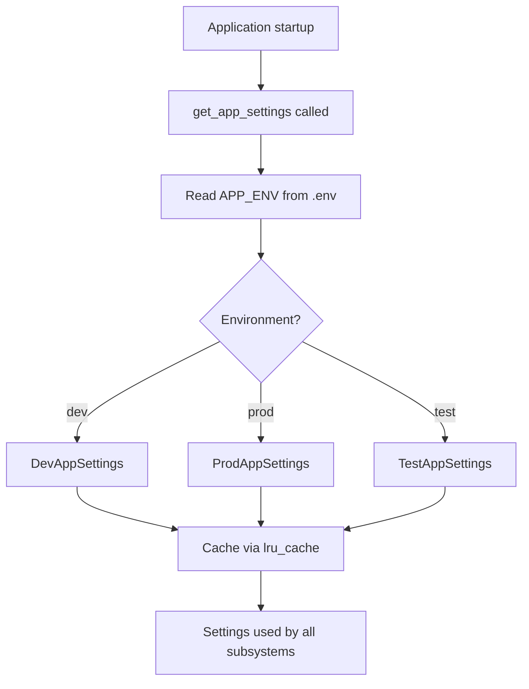

# SST - State Specification: Core Services Subsystem

## Core Data Structures

### Settings Hierarchy
```
AppEnvTypes (Enum): prod, dev, test
    ↓
BaseAppSettings
    ├── app_env: AppEnvTypes
    └── Config.env_file = ".env"
        ↓
    AppSettings (main)
    ├── database_url: PostgresDsn
    ├── secret_key: SecretStr
    ├── max/min_connection_count: int
    ├── api_prefix: str ("/api")
    ├── jwt_token_prefix: str ("Token")
    ├── debug, docs_url, openapi_*, title, version
    └── fastapi_kwargs (property) → Dict
        ↓
    DevAppSettings / ProdAppSettings / TestAppSettings
    (environment-specific overrides)
```

### JWT Structure
```
JWT Payload:
{
    "username": str,       // from JWTUser
    "exp": datetime,       // current time + 7 days
    "sub": "access"        // fixed subject
}
```

### Security Constants
- `ALGORITHM = "HS256"`
- `ACCESS_TOKEN_EXPIRE_MINUTES = 10080` (7 days)
- `JWT_SUBJECT = "access"`

## State Management

**Strategy**: Singleton settings, stateless services
- `get_app_settings()` uses `@lru_cache` to return the same settings instance
- All service functions (JWT, security, business helpers) are stateless
- No per-request or cross-request state
- `pwd_context` (CryptContext) is module-level singleton for passlib

## Data Flow



## Invariants

- **Singleton settings**: `get_app_settings()` always returns the same instance after first call (LRU cache)
- **Secret key sensitivity**: `secret_key` stored as `SecretStr` to prevent accidental logging
- **Token expiry**: All JWT tokens expire exactly 7 days (10080 minutes) from creation
- **Password uniqueness**: Each `change_password()` call generates a new random salt
- **Environment isolation**: Dev uses `.env`, prod uses `prod.env`, test uses hardcoded defaults
- **Logging single point**: `configure_logging()` is called once at startup, replaces all handlers
