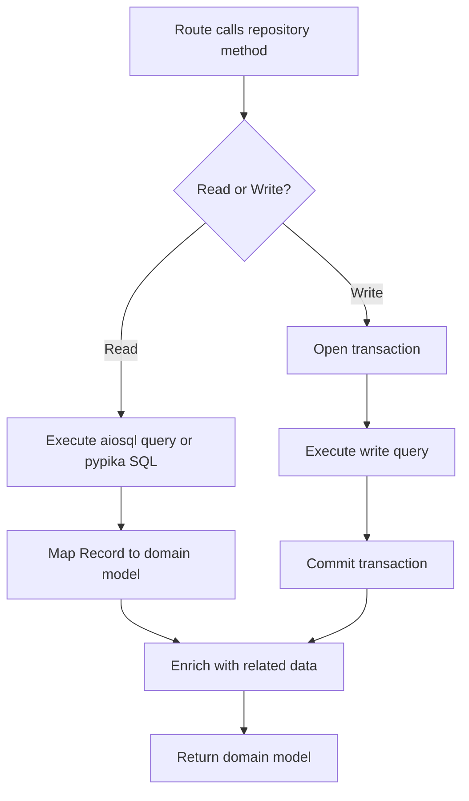

# LST - Logic Specification: Data Access Subsystem

## Main Workflow



## Key Algorithms

### Article Record Enrichment
Takes a raw article row and performs 3 additional async queries: profile lookup via ProfilesRepository, tag list retrieval, and favorite count. Optionally checks if requesting user has favorited the article.
**Complexity**: O(1) per article but N+1 pattern when listing (4 queries per article in list context)

### Dynamic Article Filtering
Builds a pypika query starting from `articles` table, conditionally joins `articles_to_tags`, `users`, or `favorites` based on filter parameters. Uses numbered `$N` parameter placeholders. Final query applies LIMIT/OFFSET.
**Complexity**: O(n) where n = result set size

### Tag Auto-Creation During Article Creation
After inserting the article, if tags are provided: calls TagsRepository to create missing tags (idempotent insert), then bulk-inserts article-to-tag associations.
**Complexity**: O(t) where t = number of tags

## Coordination Patterns

### Repository Composition
Repositories compose sibling repositories rather than calling them through DI:
- ArticlesRepository → ProfilesRepository + TagsRepository (same connection)
- CommentsRepository → ProfilesRepository (same connection)
- ProfilesRepository → UsersRepository (same connection)
This avoids DI overhead within the data access layer while maintaining connection sharing.

### Query Strategy Selection
- **Static queries** (CRUD, simple lookups): Defined in `.sql` files, loaded by aiosql
- **Dynamic queries** (filtered article listing): Built with pypika TypedTable classes
- This hybrid approach optimizes for maintainability (SQL files) while supporting flexible filtering

### Transaction Boundaries
Multi-step operations that must be atomic:
- Article creation + tag creation + tag linking (single transaction)
- Article update (single query, wrapped for consistency)
- Follow/unfollow operations (single query, wrapped for consistency)

## Error Flow

```
Repository method called
  → Execute SQL query
    → Success: map Record → domain model → return
    → EntityDoesNotExist: raised by lookup methods
    → SQL error (constraint, syntax): propagated from asyncpg
      → Route handler catches and converts to HTTP response
```

- Read methods: Entity lookup failure → `EntityDoesNotExist` → propagated to dependency layer → converted to HTTP 404
- Write methods: Constraint violation (duplicate slug, unique email) → asyncpg error → propagated to route handler
- No retry logic; errors are surfaced immediately to the caller
- All errors propagate through the call stack without subsystem-level interception
