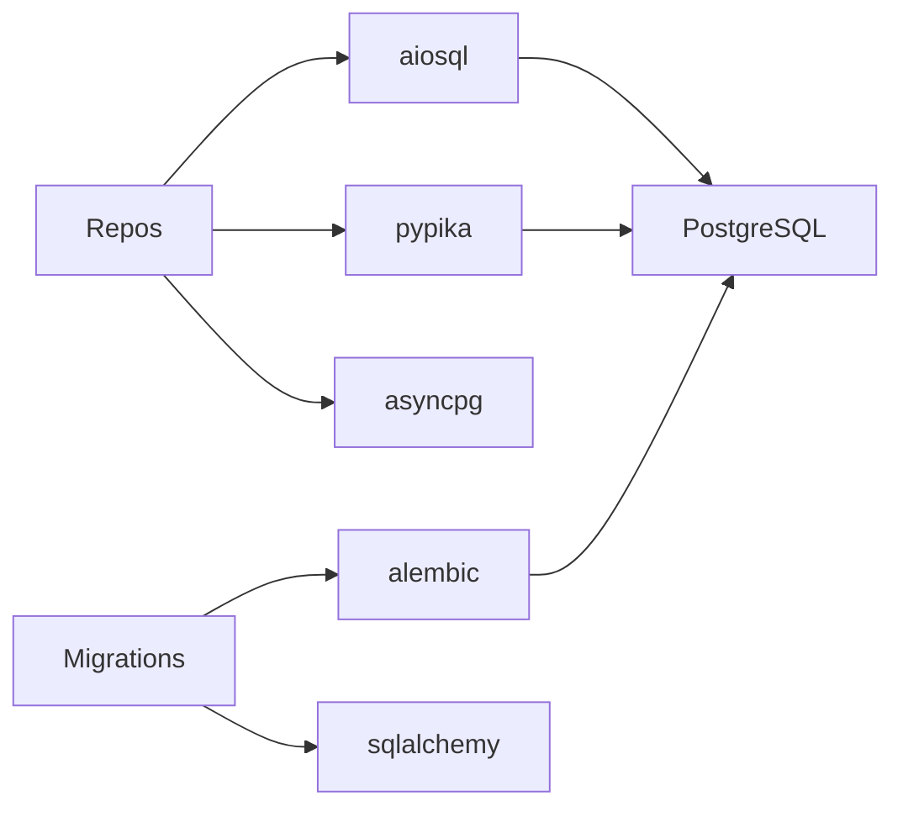

# OST - Operational Specification: Data Access Subsystem

## Overview

The Data Access subsystem manages all database interactions for the application. It provides a repository pattern abstraction over raw SQL queries, handling CRUD operations for articles, comments, users, profiles, and tags. The subsystem combines static SQL (via aiosql) with dynamic query building (via pypika) and manages the database schema through Alembic migrations.

## Public Interfaces

### Repository Layer
- **ArticlesRepository** - Full CRUD for articles with tag management, favorite tracking, filtered/paginated listing, and feed generation for followed authors
- **CommentsRepository** - CRUD for article comments with profile enrichment
- **ProfilesRepository** - Profile retrieval with follow status, follow/unfollow operations
- **UsersRepository** - User CRUD with bcrypt password hashing, lookup by email or username
- **TagsRepository** - Tag listing and auto-creation of missing tags
- **BaseRepository** - Abstract base holding asyncpg connection

### Query Layer
- **queries singleton** - 25+ callable SQL functions loaded from `.sql` files via aiosql
- **TypedTable classes** - 5 type-safe table definitions (Users, Articles, Tags, ArticlesToTags, Favorites) for pypika dynamic queries

### Migration Layer
- **upgrade()** - Creates all 7 database tables with foreign keys, cascades, and triggers
- **downgrade()** - Drops tables in reverse dependency order

## Dependencies

### Inter-Subsystem
- None (this is the foundation subsystem; all others depend on it)

### External Dependencies

## Exception Handling

- **EntityDoesNotExist** - Standard exception raised by all lookup methods when records are not found
- **Transaction isolation** - All write operations wrapped in `async with connection.transaction()`
- **SQL errors** - Constraint violations and syntax errors propagate directly from asyncpg
- **Migration failures** - Alembic manages automatic rollback on DDL errors

## Preconditions & Postconditions

**Preconditions**:
- PostgreSQL database running and accessible
- Active asyncpg connection available from pool
- Database schema matches migration state (run `alembic upgrade head`)

**Postconditions**:
- Successful reads return enriched domain models (with profiles, tags, favorite counts)
- Successful writes persist atomically and return updated models
- Tags are auto-created during article creation if missing
- Schema includes automatic `updated_at` triggers on mutable tables
