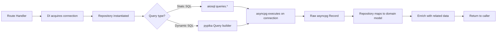

# SST - State Specification: Data Access Subsystem

## Core Data Structures

### Repository State
All repositories are **stateless** except for a single connection reference:
- **BaseRepository** - Holds `_conn: asyncpg.Connection` (injected per-request via DI)
- **ArticlesRepository** - Composes `ProfilesRepository` and `TagsRepository` instances sharing the same connection
- **CommentsRepository** - Composes `ProfilesRepository` instance sharing the same connection
- **ProfilesRepository** - Composes `UsersRepository` instance sharing the same connection

### Query Layer State
- **queries singleton** - Module-level aiosql instance, loaded once at import time, immutable thereafter
- **TypedTable instances** - Module-level pypika table objects (`users`, `articles`, `tags`, `articles_to_tags`, `favorites`), immutable

### Schema State (Database)
7 tables with the following key structures:

| Table | Key Columns | Constraints |
|-------|-------------|-------------|
| users | id, username, email, salt, hashed_password, bio, image | PK(id), UQ(username), UQ(email) |
| articles | id, slug, title, description, body, author_id, timestamps | PK(id), UQ(slug), FK(author_id→users) |
| commentaries | id, body, author_id, article_id, timestamps | PK(id), FK(author_id→users), FK(article_id→articles) |
| tags | tag | PK(tag) |
| articles_to_tags | article_id, tag | PK(article_id, tag), FKs cascade |
| favorites | user_id, article_id | PK(user_id, article_id), FKs cascade |
| followers_to_followings | follower_id, following_id | PK(follower_id, following_id), FKs cascade |

## State Management

**Strategy**: Stateless with connection injection
- Repositories are instantiated per-request via FastAPI DI (`get_repository(RepoType)`)
- Each request acquires a fresh connection from the asyncpg pool
- No cross-request state in the subsystem itself
- Database maintains all persistent state

## Data Flow

## Invariants

- **Slug uniqueness**: Article slugs must be globally unique across all articles
- **Username/Email uniqueness**: Both must be unique per user
- **Referential integrity**: All foreign keys enforce cascade or SET NULL on delete
- **Timestamp consistency**: `created_at` and `updated_at` set automatically via database triggers
- **Transaction atomicity**: Multi-table writes (article+tags, follow operations) succeed or rollback entirely
- **Tag idempotency**: `create_tags_that_dont_exist` inserts only non-existing tags (no duplicates)
