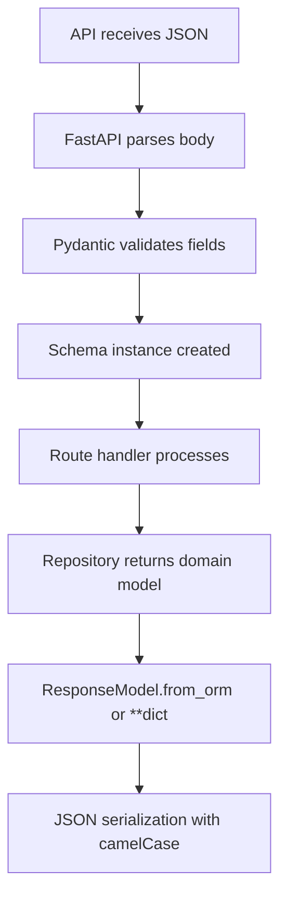

# LST - Logic Specification: Domain Model Subsystem

## Main Workflow



## Key Algorithms

### Alias Generation
`convert_field_to_camel_case` splits on `_` and capitalizes each subsequent word. `snake_case` → `snakeCase`. Applied automatically by `RWModel.Config.alias_generator` to all field names during serialization.

### Datetime Serialization
`convert_datetime_to_realworld` converts to UTC timezone, calls `.isoformat()`, then replaces `+00:00` with `Z`. Configured via `json_encoders = {datetime: converter}` in `RWModel.Config`.

### ORM Mode Mapping
`ArticleForResponse` uses dual inheritance from `RWSchema` and `Article`. Calling `ArticleForResponse.from_orm(article)` maps all domain model fields directly to the response schema, with the `tags` field aliased as `tagList` in JSON output.

## Coordination

### Domain Model → Schema Model Flow
1. Data Access subsystem returns domain model (e.g., `Article`)
2. Route handler calls `ArticleForResponse.from_orm(article)` or `ArticleForResponse(**article.dict())`
3. Pydantic maps domain fields to schema fields
4. Response model serializes to JSON with camelCase keys

### Schema Model → Domain Model Flow
1. API receives JSON request body
2. FastAPI deserializes into schema model (e.g., `ArticleInCreate`)
3. Route handler extracts fields and passes to repository
4. Repository constructs domain model from fields

### Password Handling
1. `UserInCreate` provides plaintext password (input only)
2. Repository calls `UserInDB.change_password(password)` which generates salt and hashes
3. Only `salt` and `hashed_password` stored in database
4. No password field in any response schema

## Error Flow

```
JSON input → Pydantic validation
  → Valid: schema instance → route handler
  → Invalid: HTTP 422 auto-generated by FastAPI
    → EmailStr rejects malformed email
    → HttpUrl rejects invalid URL
    → Required field missing → 422 error
```

- All validation errors are caught and formatted by FastAPI's default 422 handler
- No custom validation logic in models; constraints are type-based
- Schema inheritance ensures consistent validation across all endpoints
