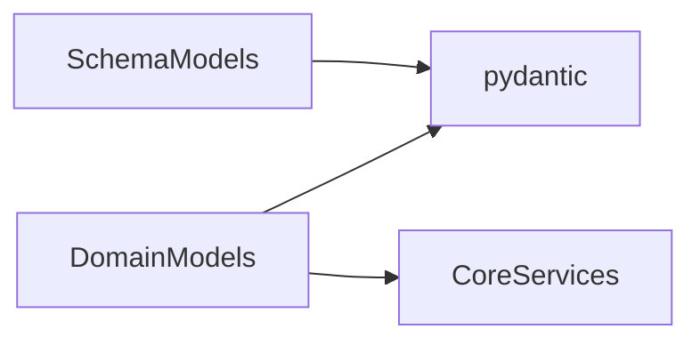

# OST - Operational Specification: Domain Model Subsystem

## Overview

The Domain Model subsystem defines the core business entities and their API-facing representations. It provides typed data structures for articles, comments, users, profiles, and all request/response schemas. The subsystem uses Pydantic for validation, automatic camelCase serialization, and ORM mode mapping.

## Public Interfaces

### Domain Models (Internal Entities)
- **Article** - Full article entity with slug, title, body, tags, author profile, favorite status
- **Comment** - Comment entity with body and author profile
- **User** - Basic user account (username, email, bio, image)
- **UserInDB** - User with credential fields (salt, hashed_password) and password verification/hashing methods
- **Profile** - Public-facing user view (username, bio, image, following status)
- **RWModel** - Base model with camelCase alias generation and UTC datetime encoding

### Schema Models (API Contracts)
- **Article schemas**: `ArticleForResponse`, `ArticleInResponse`, `ArticleInCreate`, `ArticleInUpdate`, `ListOfArticlesInResponse`, `ArticlesFilters`
- **User schemas**: `UserInCreate`, `UserInLogin`, `UserInUpdate`, `UserWithToken`, `UserInResponse`
- **Comment schemas**: `CommentInCreate`, `CommentInResponse`, `ListOfCommentsInResponse`
- **Other**: `ProfileInResponse`, `TagsInList`, `JWTMeta`, `JWTUser`, `RWSchema`

## Dependencies

### Inter-Subsystem
- **Core Services** - `app.services.security` for password hashing in UserInDB

### External Dependencies

## Exception Handling

- Pydantic validation errors automatically raised for type mismatches (EmailStr, HttpUrl, required fields)
- No custom exceptions in this subsystem; all errors are Pydantic-generated 422 responses

## Preconditions & Postconditions

**Preconditions**:
- Domain model field names must match schema model expectations for ORM mode mapping
- Field aliases must match RealWorld API specification (e.g., `tagList`)

**Postconditions**:
- All models serialize to camelCase JSON with Z-suffix UTC datetimes
- Schema models validate and reject malformed input at API boundary
