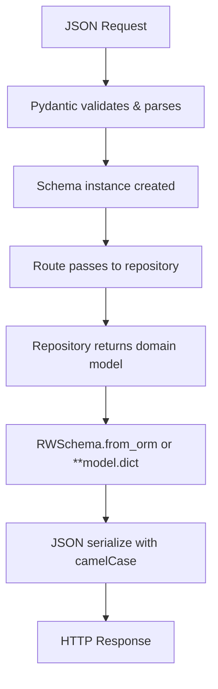

# SST - State Specification: Domain Model Subsystem

## Core Data Structures

### Entity Hierarchy
```
RWModel (Base)
├── IDModelMixin (optional: id, created_at, updated_at)
├── DateTimeModelMixin (optional: created_at, updated_at)
├── Article (IDMixin + DateTimeMixin + RWModel)
│   Fields: slug, title, description, body, tags, author, favorited, favorites_count
├── Comment (IDMixin + DateTimeMixin + RWModel)
│   Fields: body, author
├── User (RWModel)
│   Fields: username, email, bio, image
└── Profile (RWModel)
    Fields: username, bio, image, following

RWSchema (extends RWModel with orm_mode)
├── ArticleForResponse (also inherits Article)
├── ArticleInCreate / ArticleInUpdate / ArticleInResponse / ListOfArticlesInResponse / ArticlesFilters
├── UserInCreate / UserInLogin / UserInUpdate / UserWithToken / UserInResponse
├── CommentInCreate / CommentInResponse / ListOfCommentsInResponse
└── ProfileInResponse / TagsInList / JWTMeta / JWTUser
```

### Key Fields by Entity

| Entity | Key Fields | Defaults |
|--------|-----------|----------|
| Article | slug, title, description, body, tags[], author: Profile, favorited, favorites_count | - |
| Comment | body, author: Profile | - |
| User | username, email, bio, image | bio="" |
| UserInDB | salt, hashed_password | salt="", hashed_password="" |
| Profile | username, bio, image, following | bio="", following=False |

## State Management

**Strategy**: Immutable value objects
- All models are Pydantic `BaseModel` instances (immutable after creation)
- State mutations use `.copy(update={...})` pattern rather than in-place modification
- Exception: `UserInDB.change_password()` directly mutates salt and hashed_password
- No cross-instance or cross-request state

## Data Flow



## Invariants

- **Field naming**: All Python fields use snake_case; all JSON keys use camelCase (via `alias_generator`)
- **Datetime format**: All datetime fields serialize as ISO 8601 with `Z` suffix (e.g., `2026-04-29T00:00:00Z`)
- **Population by field name**: `allow_population_by_field_name = True` allows both snake_case and camelCase for input
- **ORM mode**: `ArticleForResponse` inherits from both `RWSchema` and `Article` domain model, enabling `from_orm()` mapping
- **Password never exposed**: No schema model returns `hashed_password` or `salt` in API responses
- **Profile following**: `following` defaults to `False`; only set to `True` after explicit follow check
