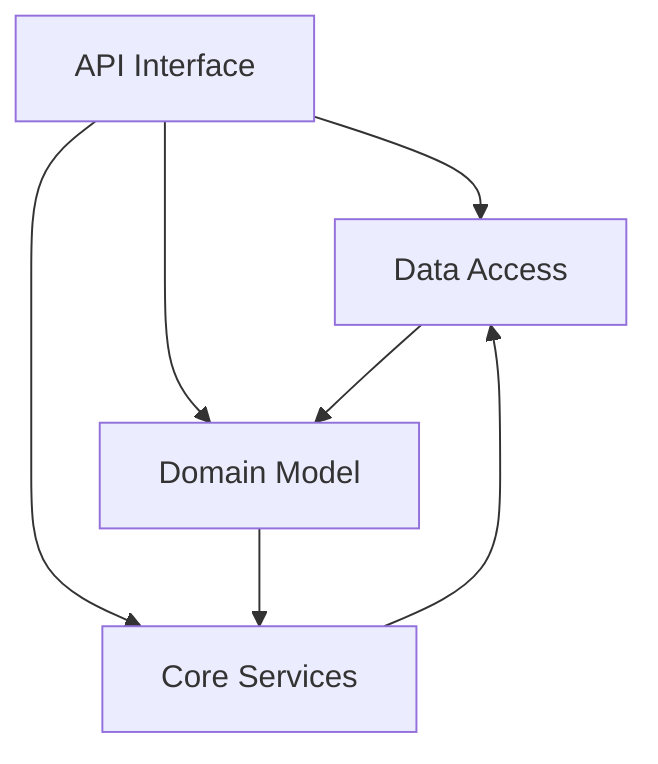

# DLD Summary

Generated: 2026-04-29

## Subsystems

Total: **4 subsystems** (aggregated from 11 modules)

### Data Access Subsystem
**Aggregated Modules**: db-repositories, db-queries, db-migrations, db-migrations-versions
**Total Lines**: 1,065
**Key Responsibilities**: All database CRUD operations, SQL query management (aiosql + pypika), schema migrations
**Documents**: [OST](data-access/OST.md), [FST](data-access/FST.md), [SST](data-access/SST.md), [LST](data-access/LST.md)

### Domain Model Subsystem
**Aggregated Modules**: models-domain, models-schemas
**Total Lines**: 201
**Key Responsibilities**: Business entity definitions, API request/response schemas, serialization with camelCase conversion
**Documents**: [OST](domain-model/OST.md), [FST](domain-model/FST.md), [SST](domain-model/SST.md), [LST](domain-model/LST.md)

### API Interface Subsystem
**Aggregated Modules**: api-routes, api-routes-articles, api-dependencies
**Total Lines**: 860
**Key Responsibilities**: HTTP routing, JWT authentication, dependency injection, entity lookup, authorization guards
**Documents**: [OST](api-interface/OST.md), [FST](api-interface/FST.md), [SST](api-interface/SST.md), [LST](api-interface/LST.md)

### Core Services Subsystem
**Aggregated Modules**: app-services, core-settings
**Total Lines**: 218
**Key Responsibilities**: Environment configuration, JWT token management, password security, business logic helpers
**Documents**: [OST](core-services/OST.md), [FST](core-services/FST.md), [SST](core-services/SST.md), [LST](core-services/LST.md)

## Aggregation Logic

```
db-repositories ────────┐
db-queries ─────────────┼─→ Data Access Subsystem
db-migrations ──────────┤
db-migrations-versions ─┘

models-domain ──────────┐
models-schemas ─────────┼─→ Domain Model Subsystem
                        │

api-routes ─────────────┐
api-routes-articles ────┼─→ API Interface Subsystem
api-dependencies ───────┘

app-services ───────────┐
core-settings ──────────┼─→ Core Services Subsystem
```

**Ratios**: 11 modules → 4 subsystems (2.75:1 ratio)

## Subsystem Dependency Graph



**Flow**: API Interface receives HTTP requests, delegates to Data Access for persistence, uses Domain Model for data shapes, and Core Services for authentication/configuration. Data Access returns domain models to API Interface. Core Services provides JWT and password operations used by both API Interface and Domain Model.

## Next Steps
Run `/reversekit-hld` to generate High-Level Design.
