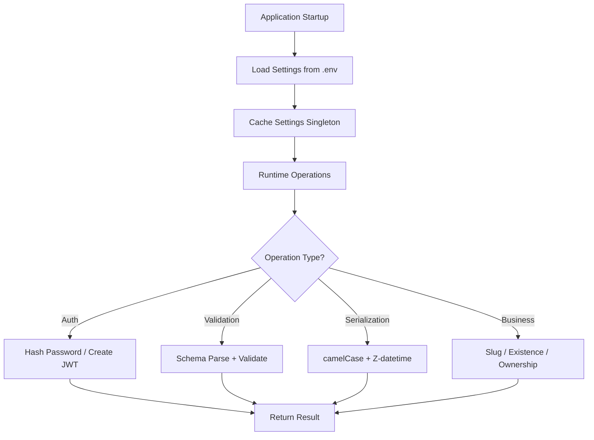

# LST - Logic Specification: Domain Layer

## Main Workflow

## Architectural Patterns

### Typed Data Model Pattern
All entities are Pydantic `BaseModel` subclasses providing:
- Runtime type validation at construction time
- Automatic serialization/deserialization
- ORM mode for mapping from database records
- Field aliasing for API naming convention translation
This eliminates manual data transformation code throughout the system.

### Singleton Configuration
`@lru_cache` ensures settings are loaded once and shared across all requests. The factory pattern (`get_app_settings()`) abstracts environment selection from consumers.

### Cryptographic Abstraction
Password operations and JWT management are isolated in dedicated service modules. Consumers call simple functions (`verify_password`, `create_access_token_for_user`) without managing cryptographic details (algorithms, salts, key handling).

## Cross-Cutting Concerns

### Validation
Pydantic handles all data validation:
- Type coercion (strings to integers, etc.)
- Format validation (EmailStr, HttpUrl)
- Required field enforcement
- Constraint validation (ge, min_length)
Validation errors are automatically converted to HTTP 422 responses by FastAPI.

### Serialization
Two-directional transformation:
- **Input**: camelCase JSON → snake_case Python (via `allow_population_by_field_name`)
- **Output**: snake_case Python → camelCase JSON (via `alias_generator` + `orm_mode`)
Datetime fields automatically formatted to ISO 8601 with Z suffix.

### Error Handling
Domain Layer rarely catches errors; it raises and propagates:
- Pydantic validation errors → HTTP 422 (handled by FastAPI)
- `ValueError` from JWT decode → HTTP 403 (handled by auth dependency)
- `EntityDoesNotExist` from existence checks → boolean False (handled by caller)

## Performance

- **Model creation**: Pydantic validation is fast (compiled C validators); ~microseconds per model
- **JWT operations**: PyJWT encode/decode is fast; O(1) for small payloads
- **bcrypt hashing**: Intentionally slow (~100ms per hash); security feature, not a bug
- **Settings caching**: O(1) after first call via `@lru_cache`
- **Bottleneck**: bcrypt hashing during registration/login; mitigated by infrequent occurrence

## Extension

Adding new business entities:
1. Define domain model in `app/models/domain/` (inherit from RWModel + mixins)
2. Define schema models in `app/models/schemas/` (inherit from RWSchema)
3. Add fields using typed Python attributes; serialization handles the rest

Adding new services:
1. Create module in `app/services/`
2. Implement pure functions (stateless, no side effects)
3. Import and use in route handlers or dependencies
