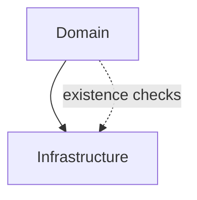

# OST - Operational Specification: Domain Layer

## Overview

The Domain Layer is the system's business logic core. It defines the entity model (articles, users, comments, profiles), provides API request/response contracts, manages JWT token lifecycle, handles password cryptography, and supplies configuration management. This layer encapsulates all business rules independent of HTTP transport or database technology.

## System-Level Interfaces

### Entity Model
Typed data structures representing all business entities:
- **Article** - Content entity with slug, title, body, tags, author, favorite status
- **User/UserInDB** - Account entity with credential management (bcrypt hashing)
- **Profile** - Public view of a user with follow status
- **Comment** - Engagement entity attached to articles

### API Contracts
Pydantic schema models defining the RealWorld API specification:
- Request bodies: `ArticleInCreate`, `UserInCreate`, `UserInLogin`, `CommentInCreate`, `UserInUpdate`, `ArticleInUpdate`
- Response wrappers: `ArticleInResponse`, `UserInResponse`, `ProfileInResponse`, `CommentInResponse`, `ListOfArticlesInResponse`
- All schemas serialize to camelCase JSON with UTC datetime formatting

### Token Service
- **create_access_token_for_user(user, secret_key) → JWT string** - Issues 7-day HS256 tokens
- **get_username_from_token(token, secret_key) → username** - Validates and decodes tokens

### Configuration Service
- **get_app_settings() → AppSettings** - Environment-specific configuration singleton
- Three profiles: dev (debug, verbose logging), prod (production defaults), test (fixed secrets)

## Dependencies

### Inter-Component

### External Dependencies
- **pydantic** - Data validation and serialization
- **PyJWT** - JWT token encoding/decoding
- **bcrypt / passlib** - Password hashing and verification
- **python-slugify** - URL-safe slug generation
- **loguru** - Unified logging

## Deployment

- **Packaging**: Python package modules deployed alongside the application
- **Configuration**: `.env` file read at startup; `APP_ENV` selects settings profile
- **Runtime**: Loaded by FastAPI application at import time; no separate process
- **Resources**: Minimal CPU; crypto operations (bcrypt) are the most expensive

## Quality Attributes

- **Performance**: Model serialization is fast (Pydantic compiled validators); bcrypt hashing is intentionally slow (security feature)
- **Security**: Passwords hashed with per-user bcrypt salt; JWT tokens signed with HS256; secrets stored as `SecretStr` to prevent log leakage
- **Maintainability**: Clear separation between domain models (internal) and schema models (API-facing); inheritance-based mixin composition avoids duplication
- **Extensibility**: Adding new entities requires defining a domain model + schema models; existing serialization infrastructure handles the rest
