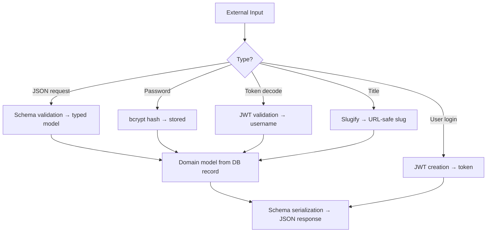

# SST - State Specification: Domain Layer

## Core Architectural Structures

### Entity Hierarchy
```
RWModel (Pydantic base with camelCase alias, datetime encoding)
├── IDModelMixin (id, created_at, updated_at - optional)
├── DateTimeModelMixin (created_at, updated_at - optional)
├── Article (ID + DateTime + RWModel)
│   └─→ slug, title, description, body, tags[], author, favorited, favorites_count
├── Comment (ID + DateTime + RWModel)
│   └─→ body, author
├── User (RWModel)
│   └─→ username, email, bio, image
├── UserInDB (extends User)
│   └─→ salt, hashed_password + check_password() / change_password()
└── Profile (RWModel)
    └─→ username, bio, image, following
```

### Settings Hierarchy
```
AppEnvTypes (Enum): prod, dev, test
    ↓
BaseAppSettings (app_env, .env config)
    ↓
AppSettings (database_url, secret_key, pool sizes, API prefix)
    ↓
DevAppSettings / ProdAppSettings / TestAppSettings (overrides)
```

### JWT Token Structure
```json
{
  "username": "string",
  "exp": "datetime (now + 7 days)",
  "sub": "access"
}
```

## State Management

**Strategy**: Immutable value objects + singleton configuration
- All domain and schema models are immutable Pydantic instances
- State mutations use `.copy(update={...})` pattern
- Settings singleton via `@lru_cache` on `get_app_settings()`
- Cryptographic contexts (`pwd_context`, JWT constants) are module-level immutable singletons
- No cross-request or cross-instance state

## Data Flow



## Invariants

- **Naming convention**: All Python fields use snake_case; all JSON output uses camelCase (automatic via alias generator)
- **Datetime format**: All timestamps are UTC with `Z` suffix
- **Password secrecy**: `SecretStr` wrapper prevents accidental logging; passwords never returned in API responses
- **Token expiry**: Fixed 7-day lifetime; no refresh token mechanism
- **Entity completeness**: Domain models carry all related data (article includes profile, tags, favorite count)
- **Schema-domain alignment**: Schema models inherit from or mirror domain models for consistent field mapping

## Scalability

- Immutable models are thread-safe and async-safe
- No shared state means no coordination overhead in multi-worker deployments
- Settings singleton is per-process; each worker has its own cached instance
- Cryptographic operations (bcrypt, JWT) are CPU-bound but infrequent (only on auth operations)
