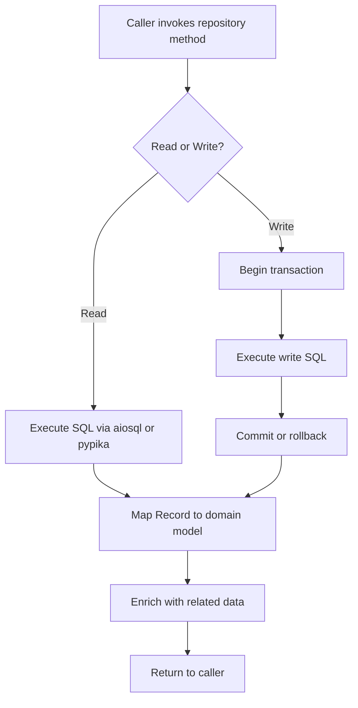

# LST - Logic Specification: Infrastructure Layer

## Main Workflow

## Architectural Patterns

### Repository Pattern
Encapsulates all data access behind typed repository classes. Each repository corresponds to a domain concept (articles, users, comments). Repositories compose sibling repositories for cross-entity operations (e.g., ArticlesRepository uses ProfilesRepository and TagsRepository) rather than going through DI, reducing overhead while maintaining connection sharing.

### Hybrid Query Strategy
- **Static SQL** (aiosql): SQL lives in `.sql` files, loaded at import time into callable functions. Best for CRUD operations and simple lookups where the query is fixed. Enables DBA review and syntax highlighting in editors.
- **Dynamic SQL** (pypika): Queries built at runtime using TypedTable classes. Used for filtered article listing where WHERE clauses depend on request parameters (tag, author, favorited). Type annotations provide IDE support.

### Connection-Per-Request
Each HTTP request acquires a fresh connection from the asyncpg pool via FastAPI DI. The connection is passed to the repository constructor and released after the handler completes. This ensures no connection leakage and clean transaction boundaries.

## Cross-Cutting Concerns

### Transaction Management
Multi-step operations wrapped in `async with connection.transaction()`:
- Article creation + tag creation + tag linking
- Article updates
- Follow/unfollow operations
Single-query operations also wrapped for consistency. Failed transactions automatically rollback.

### Record Enrichment
Raw database records are transformed into enriched domain models:
1. Map basic fields from Record to domain model constructor
2. Lookup related profile via ProfilesRepository
3. Fetch tags via TagsRepository
4. Count favorites via dedicated query
5. Check if requesting user favorited (if authenticated)
This enrichment happens in `_get_article_from_db_record` and similar methods.

### Error Propagation
- `EntityDoesNotExist` raised by lookup methods when records not found
- SQL errors (constraint violations, syntax errors) propagate directly from asyncpg
- No retry logic; errors surfaced immediately to caller
- Presentation Layer converts errors to appropriate HTTP responses

## Performance

- **asyncpg**: Fastest async PostgreSQL driver for Python; uses binary protocol
- **Connection pooling**: Eliminates per-request TCP connection overhead; pool warm-up at startup
- **Static SQL**: Pre-parsed and planned by PostgreSQL; avoids query parsing overhead
- **N+1 pattern**: Article listing makes 4 queries per article (profile, tags, favorites, favorite check); primary optimization target
- **Throughput**: Limited by database query latency and pool size; async I/O allows concurrent query waiting

## Extension

### Adding new entity support:
1. Create `.sql` file in `app/db/queries/sql/` with queries
2. Add TypedTable in `app/db/queries/tables.py` if dynamic queries needed
3. Create repository class in `app/db/repositories/`
4. Add domain model in `app/models/domain/`
5. Export repository from `app/db/repositories/__init__.py`

### Adding new migration:
1. `alembic revision -m "description"`
2. Edit generated migration file with DDL operations
3. `alembic upgrade head` to apply

The layered architecture ensures new data access patterns integrate without modifying existing repositories or query infrastructure.
