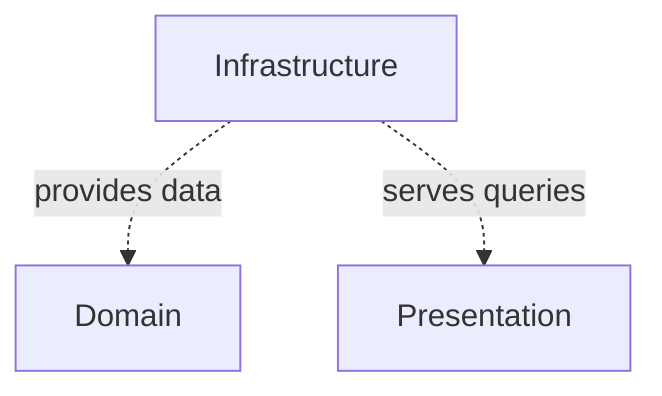

# OST - Operational Specification: Infrastructure Layer

## Overview

The Infrastructure Layer provides persistent data storage and schema evolution for the application. It implements the Repository Pattern over PostgreSQL, combining static SQL (via aiosql) with dynamic query building (via pypika). The layer manages the complete data lifecycle from schema creation through Alembic migrations to per-request CRUD operations.

## System-Level Interfaces

### Repository API
Type-safe data access interface consumed by upper layers:
- **ArticlesRepository** - Full CRUD with filtering, pagination, tag management, favorite tracking, and feed generation
- **CommentsRepository** - Article comment CRUD
- **UsersRepository** - User registration, profile updates, lookup by email/username
- **ProfilesRepository** - Profile retrieval with follow status, follow/unfollow operations
- **TagsRepository** - Tag listing and auto-creation

### Query API
Two query execution strategies:
- **aiosql queries** - 25+ pre-defined SQL functions loaded from `.sql` files for static queries (CRUD, simple lookups)
- **pypika TypedTables** - 5 type-safe table definitions for dynamic query building (filtered article listing)

### Schema Management
- **Alembic migration** - Single migration creating all 7 database tables with foreign keys, cascades, and automatic `updated_at` triggers

## Dependencies

### Inter-Component

### External Dependencies
- **asyncpg** - High-performance async PostgreSQL driver with connection pooling
- **aiosql** - SQL file loader converting `.sql` files into callable Python functions
- **pypika** - Type-safe SQL query builder for dynamic queries
- **alembic / sqlalchemy** - Schema migration framework and DDL operations
- **PostgreSQL** - Relational database server (7 tables, triggers, foreign keys)

## Deployment

- **Migration execution**: `alembic upgrade head` run before application start (CI/CD pipeline or manual)
- **Runtime**: Loaded as Python modules within the FastAPI application process
- **Connection pool**: asyncpg pool initialized at startup (5-10 connections per worker, configurable via settings)
- **SQL files**: Static `.sql` files deployed alongside code in `app/db/queries/sql/`
- **Database requirements**: PostgreSQL 12+ (for asyncpg compatibility)

## Quality Attributes

- **Performance**: asyncpg is the fastest async PostgreSQL driver; connection pooling eliminates per-request connection overhead; static SQL avoids query parsing overhead
- **Scalability**: Connection pool prevents database overload; async I/O enables concurrent queries; N+1 pattern in article listing is the primary scaling concern
- **Reliability**: Transaction-wrapped writes ensure atomicity; Alembic migrations are reversible (upgrade/downgrade); foreign key constraints enforce referential integrity
- **Maintainability**: SQL in separate `.sql` files enables DBA review; repository pattern abstracts data access; type-safe TypedTable classes prevent column name errors
