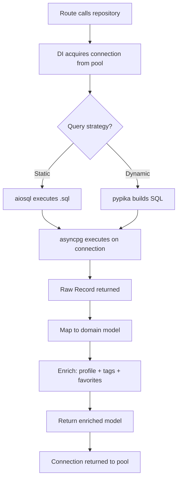

# SST - State Specification: Infrastructure Layer

## Core Architectural Structures

### Repository Pattern
All data access follows the Repository Pattern:
```
BaseRepository (holds asyncpg.Connection)
├── ArticlesRepository (composes ProfilesRepository + TagsRepository)
├── CommentsRepository (composes ProfilesRepository)
├── ProfilesRepository (composes UsersRepository)
├── UsersRepository (standalone)
└── TagsRepository (standalone)
```
Repositories are instantiated per-request via FastAPI DI with an acquired connection from the pool.

### Query Dual-Strategy
- **Static queries** (aiosql): 25+ SQL functions loaded from `.sql` files at import time; used for CRUD and simple lookups
- **Dynamic queries** (pypika): TypedTable classes for runtime query building; used for filtered article listing

### Database Schema
7 tables with the following structure:

| Table | Purpose | Key Constraints |
|-------|---------|-----------------|
| users | User accounts | PK(id), UQ(username), UQ(email) |
| articles | Blog articles | PK(id), UQ(slug), FK→users |
| commentaries | Article comments | PK(id), FK→users, FK→articles |
| tags | Article tags | PK(tag) |
| articles_to_tags | Article-tag mapping | PK(article_id, tag), cascade FKs |
| favorites | User-article favorites | PK(user_id, article_id), cascade FKs |
| followers_to_followings | User follow graph | PK(follower_id, following_id), cascade FKs |

## State Management

**Strategy**: Stateless repositories with shared connection pool
- Repository instances hold a single connection reference; no other state
- Connection pool (`app.state.pool`) is the only application-level state
- Pool initialized at startup, closed at shutdown
- All persistence is in PostgreSQL; no in-memory caching
- SQL queries loaded once at import (immutable)

## Data Flow



## Invariants

- **Referential integrity**: All foreign keys enforce cascade or SET NULL on delete
- **Uniqueness**: Article slugs, usernames, and emails are globally unique (database-level constraint)
- **Timestamp automation**: `updated_at` automatically set by database trigger on every row update
- **Transaction atomicity**: Multi-table operations (article+tags, follow) run in a single transaction
- **Connection lifecycle**: Every acquired connection is returned to the pool after use (context manager pattern)

## Scalability

- **Connection pool sizing**: `min_connection_count` and `max_connection_count` configurable per environment (5 for test/dev, 10 for prod)
- **Per-worker isolation**: Each uvicorn worker maintains its own pool; total connections = workers × max_pool_size
- **Query optimization**: Static SQL avoids runtime query building overhead; dynamic queries use parameterized placeholders
- **Scaling bottleneck**: Database is the single bottleneck; read replicas or connection pooling middleware (PgBouncer) would be needed for high-traffic scaling
