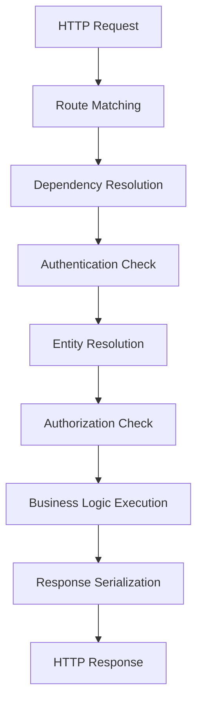

# LST - Logic Specification: Presentation Layer

## Main Workflow

## Architectural Patterns

### Layered Architecture
The Presentation Layer is the top tier of a 3-layer architecture:
- **Presentation** (this layer) → HTTP handling, routing, validation
- **Domain** → Business entities, JWT, password security
- **Infrastructure** → Database CRUD, migrations

Each layer depends only on layers below it, creating a strict dependency hierarchy.

### Dependency Injection Pattern
FastAPI's DI framework resolves dependencies in topological order:
1. Leaf dependencies (settings, pool reference) → no dependencies themselves
2. Mid-level dependencies (repository instances, authenticated user) → depend on leaves
3. Route handler → depends on all above
This eliminates boilerplate and ensures consistent lifecycle management.

### Guard Pattern
Authorization checks implemented as dependency guards:
- `check_article_modification_permissions` runs before the handler
- If guard fails (HTTPException raised), handler never executes
- Applied declaratively via `dependencies=[...]` parameter on route decorators

## Cross-Cutting Concerns

### Error Handling
Centralized exception handlers convert Python exceptions to HTTP responses:
- `HTTPException` → consistent JSON error format via `http_error_handler`
- `RequestValidationError` → structured validation errors via `http422_error_handler`
- All error messages sourced from `app.resources.strings` for centralization

### Logging
Loguru intercepts all stdlib logging (including uvicorn access logs) via `InterceptHandler`. Unified log output to stderr at configurable level.

### CORS
Configurable CORS middleware allows cross-origin requests. Default `allow_origins=["*"]` permissive; configurable via settings.

## Performance

- **Async I/O**: All handlers are async functions, enabling concurrent request processing within a single worker
- **Connection pooling**: asyncpg pool (5-10 connections) avoids per-request connection overhead
- **Cached settings**: `@lru_cache` on `get_app_settings()` eliminates repeated env file reads
- **Bottleneck**: Database query latency dominates response time; N+1 pattern in article listing (4 queries per article) is the primary optimization target

## Extension

Adding new API endpoints follows this pattern:
1. Define route in appropriate `app/api/routes/` file
2. Create schema models in `app/models/schemas/` for request/response
3. Add repository methods in `app/db/repositories/` if new data access needed
4. Add DI providers in `app/api/dependencies/` if entity lookup or auth needed
5. Mount router in `app/api/routes/api.py` if new resource domain

The layered architecture ensures new features integrate cleanly without modifying existing layers.
