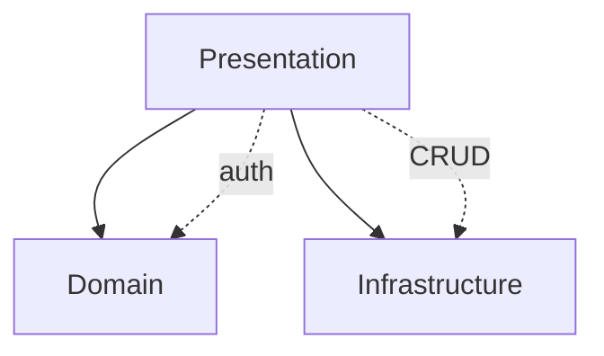

# OST - Operational Specification: Presentation Layer

## Overview

The Presentation Layer is the system's external boundary, exposing the RealWorld REST API over HTTP. It handles all client-facing concerns: request routing, authentication, input validation, authorization, and response formatting. Built on FastAPI with async/asyncpg, it serves as the single entry point for all application operations.

## System-Level Interfaces

### HTTP API (Primary Interface)
RESTful API mounted at `/api` prefix, implementing the full RealWorld specification:
- **Authentication**: User registration and login with JWT token issuance
- **User Management**: Retrieve and update current user profile
- **Social**: Profile viewing, follow/unfollow operations
- **Content**: Article CRUD with tagging, filtering, pagination, and feed generation
- **Engagement**: Article favorites, article comments

### Response Contract
All responses follow RealWorld JSON format:
- Wrapped objects: `{user: {...}}`, `{article: {...}}`, `{profile: {...}}`
- camelCase field names, ISO 8601 datetimes with `Z` suffix
- Standard HTTP status codes: 200 (read/update), 201 (create), 204 (delete)

### Authentication Interface
- `Authorization: Token <jwt>` header format
- JWT HS256 tokens with 7-day expiry
- Optional vs required authentication per endpoint

## Dependencies

### Inter-Component

### External Dependencies
- **FastAPI** - Web framework (routing, DI, validation, OpenAPI)
- **starlette** - ASGI foundation
- **Pydantic** - Request/response validation
- **PostgreSQL** - Persistent data store (via Infrastructure Layer)

## Deployment

- **Runtime**: ASGI server (uvicorn) in async mode
- **Process**: Single process with async event loop (or multiple workers)
- **Configuration**: `.env` file with DATABASE_URL, SECRET_KEY, APP_ENV
- **Port**: Configurable, default uvicorn port 8000
- **Health**: FastAPI auto-generated `/docs` (Swagger) and `/openapi.json` endpoints

## Quality Attributes

- **Performance**: Async I/O enables high concurrent request handling; connection pool (5-10 connections) prevents database overload
- **Scalability**: Stateless design allows horizontal scaling behind load balancer; each worker is independent
- **Availability**: No single point of failure within the layer; depends on database and external services
- **Security**: JWT-based auth with token validation on every protected endpoint; input validation via Pydantic schemas; CORS middleware configurable via settings
- **Observability**: Loguru logging with uvicorn access log interception; structured error responses via centralized error handlers
