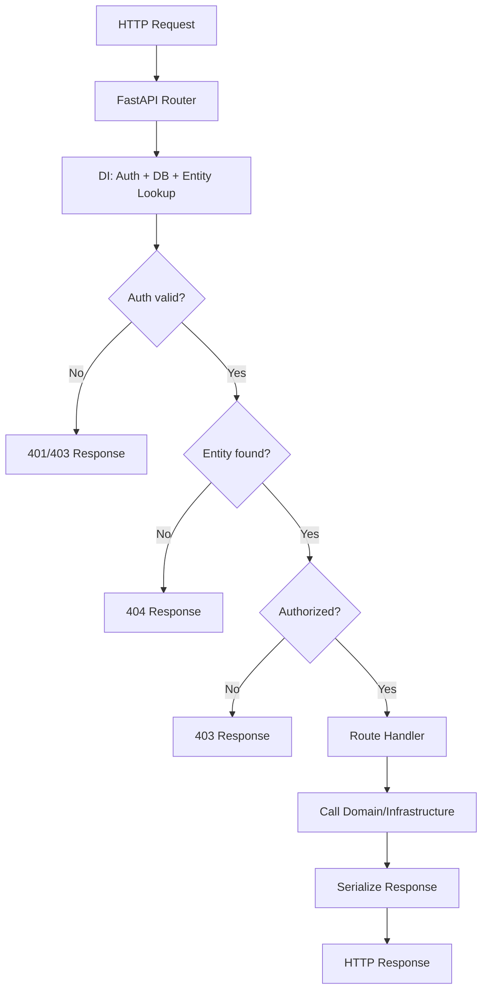

# SST - State Specification: Presentation Layer

## Core Architectural Structures

### Route Registry
FastAPI `APIRouter` instances organized hierarchically:
- **Root router** (`/api`) - Aggregates all sub-routers
- **Sub-routers** - Grouped by resource domain (articles, users, profiles, comments, tags)
- Each route maps to an async handler function with typed parameters

### Dependency Injection Graph
FastAPI DI resolves a directed acyclic graph per request:
```
Route Handler
├── get_current_user_authorizer
│   ├── _get_authorization_header (extracts from request)
│   └── get_app_settings (singleton, cached)
├── get_repository(RepoType)
│   ├── _get_connection_from_pool
│   │   └── _get_db_pool (from app.state)
│   └── repo_type(conn)
└── Entity lookup (e.g., get_article_by_slug_from_path)
    └── Repository method call
```

### Request Context
Per-request state (not persisted):
- Authenticated user identity (User or None)
- Acquired database connection (from pool)
- Validated request body (schema instance)
- Resolved path entities (domain models)

## State Management

**Strategy**: Fully stateless, connection-per-request
- No server-side session state
- Authentication state encoded in client-held JWT
- Database connections acquired per-request from pool, returned after handler completes
- Application-level state limited to `app.state.pool` (connection pool reference)

## Data Flow



## Invariants

- **Statelessness**: No request modifies shared state; all workers are independent
- **Strict layering**: Presentation Layer never accesses database directly; always through Infrastructure Layer repositories
- **Auth consistency**: All protected endpoints use the same JWT validation pipeline
- **Response uniformity**: All responses follow RealWorld spec format regardless of endpoint

## Scalability

- Stateless design enables horizontal scaling (add workers behind load balancer)
- Connection pool size is per-worker; total DB connections = workers × pool_size
- No shared cache or session means no coordination between instances
- Single bottleneck: PostgreSQL database; scales via read replicas (not currently implemented)
