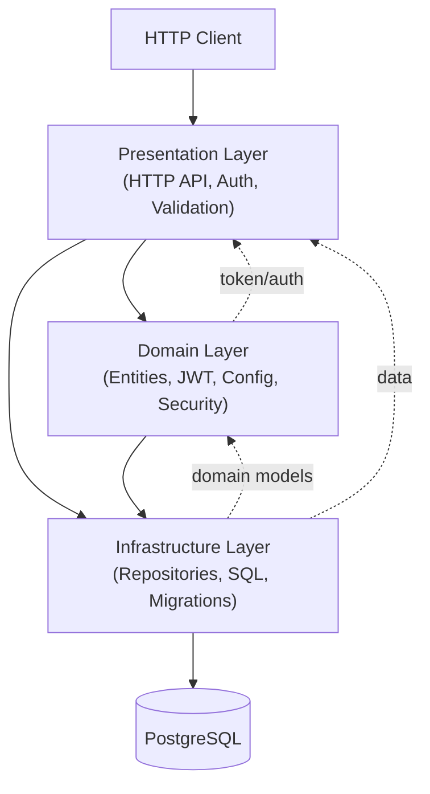

# HLD Summary

Generated: 2026-04-29

## System Architecture

Total: **3 components** (aggregated from 4 DLD subsystems)

### Component 1: Presentation Layer
**Aggregated Subsystems**: API Interface
**Architectural Role**: External-facing HTTP API boundary
**Key Responsibilities**: HTTP routing, JWT authentication, request validation, authorization guards, response formatting per RealWorld spec
**Documents**: [OST](presentation-layer/OST.md), [FST](presentation-layer/FST.md), [SST](presentation-layer/SST.md), [LST](presentation-layer/LST.md)

### Component 2: Domain Layer
**Aggregated Subsystems**: Domain Model + Core Services
**Architectural Role**: Business logic and entity modeling core
**Key Responsibilities**: Entity definitions, API contracts, JWT token lifecycle, password cryptography, configuration management, business logic helpers
**Documents**: [OST](domain-layer/OST.md), [FST](domain-layer/FST.md), [SST](domain-layer/SST.md), [LST](domain-layer/LST.md)

### Component 3: Infrastructure Layer
**Aggregated Subsystems**: Data Access
**Architectural Role**: Persistent data storage and schema evolution
**Key Responsibilities**: Repository-pattern CRUD, static SQL (aiosql), dynamic queries (pypika), Alembic migrations, connection pooling
**Documents**: [OST](infrastructure-layer/OST.md), [FST](infrastructure-layer/FST.md), [SST](infrastructure-layer/SST.md), [LST](infrastructure-layer/LST.md)

## System Architecture Diagram



## Architectural Decisions

**Decision 1: Strict Layered Architecture**
The system follows a classic 3-layer pattern where each layer depends only on layers below it. This creates clear boundaries, enables independent testing of each layer, and simplifies reasoning about data flow. The trade-off is some verbosity (data passes through multiple layers) in exchange for maintainability.

**Decision 2: Hybrid Query Strategy**
Combining aiosql (static SQL files) with pypika (dynamic query building) optimizes for both maintainability and flexibility. Simple CRUD queries live in readable `.sql` files, while complex filtered queries are built programmatically. The trade-off is two query paradigms to understand.

**Decision 3: Stateless Design**
No server-side session state; authentication encoded in client-held JWT. This enables horizontal scaling without session replication, at the cost of JWT token invalidation requiring client-side action (logout doesn't invalidate server-side).

## Aggregation Rationale

The 4 DLD subsystems naturally group into 3 architectural layers based on dependency direction and responsibility:

```
API Interface ────────────────────→ Presentation Layer (single subsystem, clear boundary)

Domain Model ──┐
               ├─→ Domain Layer (tightly coupled: entities + services that operate on them)
Core Services ─┘

Data Access ──────────────────────→ Infrastructure Layer (single subsystem, foundation)
```

Domain Model and Core Services merge because they share a responsibility boundary: business logic independent of HTTP transport and database technology. Core Services' existence checks depend on Data Access, but conceptually they belong to the domain (business rules about entity uniqueness).

**Ratio**: 4 subsystems → 3 components (1.33:1 ratio)

## Quality Attributes

- **Performance**: Async I/O throughout; connection pooling eliminates per-request overhead; primary bottleneck is database query latency
- **Scalability**: Stateless presentation layer enables horizontal scaling; Infrastructure Layer limited by single PostgreSQL instance
- **Maintainability**: Clear layer boundaries enable independent modification; repository pattern abstracts data access; Pydantic schemas provide self-documenting API contracts
- **Extensibility**: Adding new entities requires defining models in Domain Layer + repositories in Infrastructure Layer; Presentation Layer wiring follows established DI patterns

## Technology Stack

- **Language**: Python 3.11+ (detected from .pyc files and pyproject.toml)
- **Web Framework**: FastAPI with async/await
- **Database**: PostgreSQL via asyncpg (async driver)
- **Query Management**: aiosql (static SQL files) + pypika (dynamic query builder)
- **Migrations**: Alembic with SQLAlchemy DDL
- **Authentication**: PyJWT (HS256), bcrypt + passlib (password hashing)
- **Validation**: Pydantic (request/response schemas, settings)
- **Logging**: Loguru with uvicorn access log interception
- **Package Manager**: Poetry (pyproject.toml, poetry.lock)
- **Deployment**: Docker (Dockerfile, docker-compose.yml), uvicorn ASGI server

## Next Steps

Run `/reversekit-sld` to generate System-Level Design.
