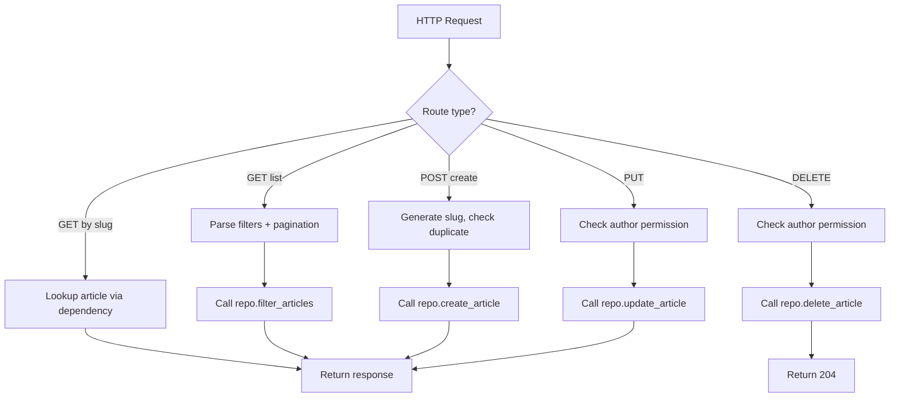

# LST - Logic Specification: Article Routes

## Main Workflow

## Key Algorithms

**Article Creation Flow**: Validates request body → generates slug from title via `slugify()` → checks slug uniqueness → calls repository with slug, title, description, body, author, and optional tags → returns response with `ArticleForResponse.from_orm()`.

**Favorite Toggle Flow**: Retrieves article by slug → checks current favorited state → if toggling on and already favorited (or off and not favorited), returns HTTP 400 → otherwise calls repository add/remove → constructs response with adjusted `favorites_count` using `article.copy(update={...})`.

## Control Flow

- **Branch**: List vs feed vs single article retrieval
- **Branch**: Favorite/unfavorite based on endpoint method (POST vs DELETE)
- **Guard**: Duplicate slug check before article creation
- **Guard**: Author permission check before update/delete (via dependency)
- **Error**: 400 on duplicate favorite operations

## Business Rules

- Article slug is derived from title using python-slugify, must be unique
- Only the article author can update or delete an article
- Favorite is idempotent at the route level (returns 400 if already in that state)
- Feed only shows articles from followed authors (repository handles the join)
- Article listing returns count alongside the array (RealWorld spec requirement)
