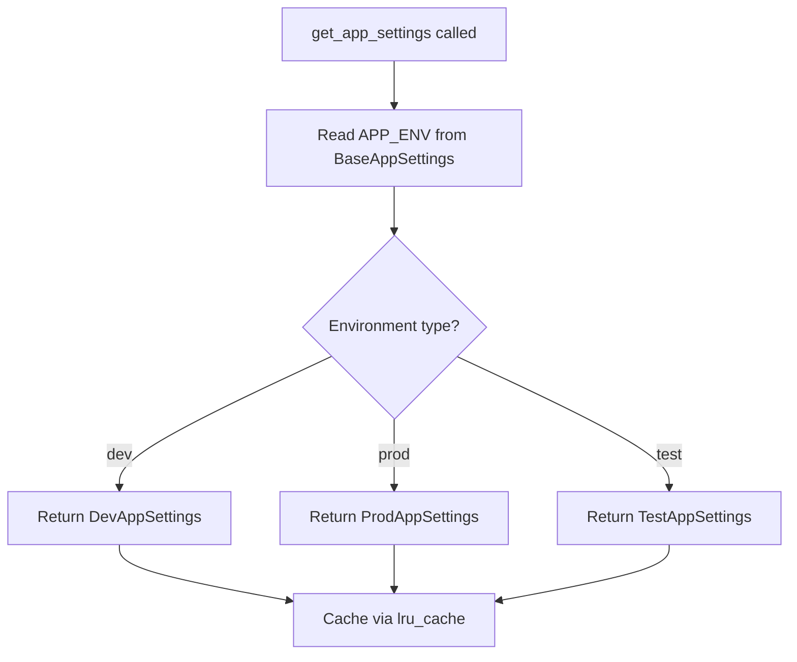

# LST - Logic Specification: Settings

## Main Workflow

## Key Algorithms

**Settings Factory** (`get_app_settings`): Uses `@lru_cache` to singleton the result. Creates a temporary `BaseAppSettings()` instance to read `app_env`, then looks up the corresponding class in the `environments` dict and instantiates it. The cache ensures subsequent calls return the same instance.

**Logging Configuration**: Replaces root logger's handlers with `InterceptHandler`, then does the same for `uvicorn.asgi` and `uvicorn.access` loggers. Finally configures loguru to write to stderr at the configured level.

## Control Flow

- **Branch**: Environment type determines which settings subclass to instantiate
- **Lazy init**: `get_app_settings` is called on first access, then cached

## Business Rules

- Production settings use `prod.env` file instead of `.env`
- Test settings default `secret_key` to "test_secret" for fixture compatibility
- Dev/test use smaller connection pools (5 vs 10)
- JWT token format is fixed as "Token <jwt>" prefix
