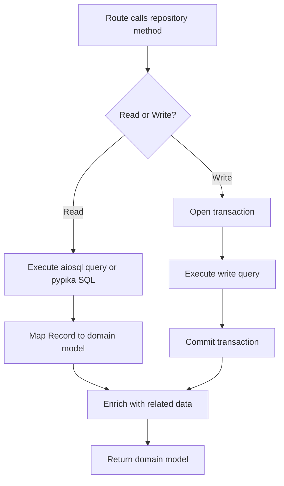

# LST - Logic Specification: Repositories

## Main Workflow

## Key Algorithms

**Article Record Enrichment** (`_get_article_from_db_record`):
Takes a raw article row, then makes 3 additional async queries: profile lookup via `_profiles_repo`, tag list via `get_tags_for_article_by_slug`, and favorite count via `get_favorites_count_for_article_by_slug`. Optionally checks if the requesting user has favorited the article.
**Complexity**: O(1) per article but N+1 pattern when listing (4 queries per article)

**Dynamic Article Filtering** (`filter_articles`):
Builds a pypika query starting from `articles` table, then conditionally joins `articles_to_tags`, `users`, or `favorites` tables based on filter parameters. Uses numbered `Parameter($N)` placeholders. Final query applies LIMIT/OFFSET and executes via raw SQL.
**Complexity**: O(n) where n = result set size

**Tag Creation During Article Creation**:
After inserting the article, checks if tags were provided. If so, calls `TagsRepository.create_tags_that_dont_exist()` (inserts only non-existing tags), then links article to tags via `_link_article_with_tags` which bulk-inserts into `articles_to_tags`.

## Control Flow

- **Branch**: Article creation → if tags exist, create missing tags then link
- **Branch**: Article retrieval → if not found, raise `EntityDoesNotExist`
- **Loop**: Comment list → iterate comment rows, map each to Comment with profile lookup
- **Loop**: Filter results → iterate article rows, enrich each with tags/profiles/favorites
- **Error**: Entity lookup → catch missing record → raise `EntityDoesNotExist`

## Business Rules

- Articles are identified by slug (derived from title), which must be unique
- Only the article author can update or delete their article (enforced at dependency layer, not here)
- Users cannot follow themselves (enforced at profile route layer)
- Tag names are case-sensitive strings stored as-is
- Favorites are idempotent: adding a favorited article or removing a non-favorited one raises HTTP 400 (enforced at route layer)
- Password hashing uses bcrypt with per-user salt, handled in `UserInDB.change_password()`
