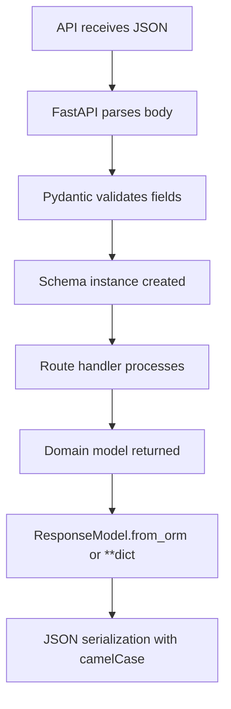

# LST - Logic Specification: Schema Models

## Main Workflow

## Key Algorithms

**Alias Generation**: `convert_field_to_camel_case` splits on `_` and capitalizes each subsequent word. `snake_case` → `snakeCase`. Applied automatically by `RWModel.Config.alias_generator`.

**Datetime Serialization**: `convert_datetime_to_realworld` converts to UTC, appends `Z` suffix (replacing `+00:00`). Configured via `json_encoders` in `RWModel.Config`.

**ArticleForResponse**: Inherits from both `RWSchema` and `Article` domain model simultaneously. This allows `ArticleForResponse.from_orm(article)` to map domain model fields directly, with the `tags` field aliased as `tagList`.

## Control Flow

- **Validation**: Pydantic field types enforce constraints at deserialization time
- **Defaults**: `tags=[]` in ArticleInCreate, `limit=20`/`offset=0` in ArticlesFilters
- **Optional fields**: All update schema fields are Optional with None defaults

## Business Rules

- All JSON responses follow RealWorld spec: `{article: {...}}`, `{articles: [...], articlesCount: N}`
- Email validation uses pydantic's `EmailStr` type
- Password fields are never returned in responses (only in request schemas)
