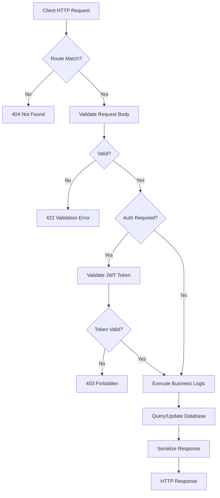

# LST - Logic Specification: Conduit (RealWorld API)

## System Workflow



## System Initialization

1. **Module Import**: Python loads all application modules; aiosql parses SQL files into callable functions; Pydantic validates class definitions
2. **Settings Resolution**: `get_app_settings()` reads `APP_ENV` from `.env`, selects appropriate settings subclass (Dev/Prod/Test), caches result via `@lru_cache`
3. **Logging Configuration**: `configure_logging()` replaces stdlib logging handlers with Loguru interceptors for unified log output
4. **FastAPI Construction**: Application instantiated with settings-derived kwargs (debug mode, docs URLs, title); CORS middleware added
5. **Database Connection**: Startup handler creates asyncpg connection pool with configured min/max sizes; pool stored in `app.state.pool`
6. **Route Mounting**: All sub-routers mounted under `/api` prefix with appropriate tags
7. **Ready**: Server accepts HTTP connections on configured port

## Core Processing Patterns

### Request Processing Pipeline
Every request follows the same pipeline: route matching → dependency resolution (auth + DB + entity lookup) → handler execution → response serialization. FastAPI's DI framework resolves dependencies in topological order before the handler executes.

### Authentication Flow
Extract `Authorization` header → split on space → validate token prefix matches settings → decode JWT with secret key → extract username → look up user in database → return User or raise 403. Two variants exist: required (raises 401 if header missing) and optional (returns None).

### Data Access Pattern
Route handler receives repository instance (via DI) → calls repository method with keyword arguments → repository executes SQL (aiosql for static, pypika for dynamic) → raw Record mapped to domain model → domain model enriched with related data (profile, tags, favorites) → returned to handler → serialized to response schema.

## Error Handling Strategy

### Fatal Errors (Application Startup Failure)
- Missing `DATABASE_URL` or `SECRET_KEY` in `.env`: Pydantic validation error, application refuses to start
- Database unreachable at startup: asyncpg connection error, application fails to initialize pool
- These errors are terminal; no retry or fallback

### Recoverable Errors (Per-Request Failures)
- **401 Unauthorized**: Missing or malformed Authorization header
- **403 Forbidden**: Invalid JWT, wrong token prefix, or insufficient permissions
- **404 Not Found**: Entity not found by slug, ID, or username
- **400 Bad Request**: Business rule violations (duplicate slug, self-follow, already favorited)
- **422 Validation Error**: Malformed request body (missing fields, invalid email/URL format)
- **500 Internal Server Error**: Unexpected exceptions not explicitly handled

All errors return consistent JSON format: `{"detail": "localized error message"}`. Messages centralized in `app.resources.strings`.

### Warnings
- No built-in rate limiting or throttling; high request volume may exhaust connection pool
- No request timeout configuration; long-running queries may hold connections indefinitely

## Performance Optimization

- **Async I/O**: All handlers are async; uvicorn event loop handles concurrent requests without thread overhead
- **Connection Pooling**: asyncpg pool eliminates per-request TCP connection setup; connections reused across requests
- **Static SQL**: aiosql-loaded queries are pre-parsed by PostgreSQL; no query building overhead at runtime
- **Cached Settings**: `@lru_cache` eliminates repeated `.env` file reads
- **Bottleneck**: N+1 query pattern in article listing (4 queries per article: profile, tags, favorites, favorite check) is the primary optimization target
- **No caching layer**: All reads hit the database; no in-memory or Redis caching implemented

## System Integration Patterns

### API Client Integration
Clients interact via standard HTTP/JSON:
1. Register or login to obtain JWT token
2. Include `Authorization: Token <jwt>` in subsequent requests
3. Parse JSON responses following RealWorld format (wrapped objects, camelCase keys)
4. Handle token expiry (7 days) by re-authenticating

### Database Integration
- PostgreSQL required (12+ for asyncpg compatibility)
- Alembic migrations applied via CLI before application start
- Connection parameters via `DATABASE_URL` (supports SSL, connection options)
- No ORM; raw SQL via aiosql files or pypika query builder

### CI/CD Integration
- `pytest` for test execution (100% coverage threshold configured)
- `flake8` for linting, `black` for formatting, `isort` for import sorting, `mypy` for type checking
- Postman collection (`postman/Conduit.postman_collection.json`) for API testing
- Shell scripts in `scripts/` for format, lint, and test operations

## Quality Assurance Workflows

- **Unit/Integration Tests**: pytest with httpx.AsyncClient and asgi_lifespan.LifespanManager for full-stack API testing
- **Test Fixtures**: Fake asyncpg pool for isolated testing without real database dependency in unit tests
- **Coverage**: 100% coverage threshold enforced via pyproject.toml pytest configuration
- **Type Checking**: mypy on application code for static type validation
- **Code Quality**: flake8 (linting), black (formatting), isort (import ordering)

## Deployment Workflows

### Development
```bash
poetry install && poetry shell
# Configure .env
alembic upgrade head
uvicorn app.main:app --reload
```

### Production (Docker)
```bash
docker-compose up -d  # Starts PostgreSQL and app
# Or build custom image from Dockerfile
docker build -t conduit .
docker run -p 8000:8000 --env-file .env conduit
```

### Migration
```bash
alembic revision -m "description"  # Create new migration
alembic upgrade head               # Apply all pending migrations
alembic downgrade -1               # Rollback last migration
```

## Extension Workflows

### Adding New API Endpoints
1. Define domain model in `app/models/domain/`
2. Define request/response schemas in `app/models/schemas/`
3. Create repository in `app/db/repositories/` with SQL queries
4. Create route handler in `app/api/routes/`
5. Register route in `app/api/routes/api.py`
6. Add tests in `tests/test_api/test_routes/`

### Adding New Entity
Requires changes across all 3 layers: domain model (entity definition), infrastructure (repository + SQL), presentation (routes + schemas). The layered architecture ensures consistent integration points.

## System Lifecycle

| Phase | Trigger | Duration | Activities |
|-------|---------|----------|------------|
| Startup | Process launch | Seconds | Settings load, logging setup, pool creation, route mounting |
| Serving | Pool ready | Indefinite | Handle HTTP requests until shutdown signal |
| Shutdown | SIGTERM/SIGINT | Seconds | Drain active requests, close connection pool |
| Migration | `alembic upgrade` command | Seconds | Apply pending DDL changes to database |

The system has no hot-reload of configuration or schema changes in production. Configuration changes require application restart; schema changes require migration + restart.
