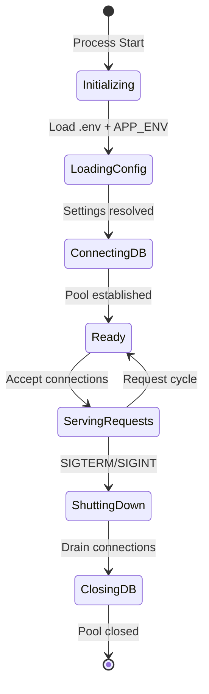

# SST - State Specification: Conduit (RealWorld API)

## System State Model

The system follows a linear lifecycle: initialize → connect → serve → shutdown. There are no runtime configuration changes; all state is established at startup and remains stable during operation.

## System Data Management

### Persistent State (PostgreSQL)
All business data persists exclusively in PostgreSQL:
- **Users**: Account credentials and profile information
- **Articles**: Published content with slugs, tags, and authorship
- **Comments**: User engagement on articles
- **Relationships**: Follow graph, favorites, article-tag associations
- **Schema**: Managed by Alembic; current version tracked in `alembic_version` table

### Session State (None)
The system maintains no server-side session state. Authentication is entirely client-managed via JWT tokens. Each request is self-contained with all necessary context in the Authorization header.

### Transient State (Per-Request)
- Database connection acquired from pool (returned after handler)
- Authenticated user identity extracted from JWT
- Validated request body parsed into schema instance
- No cross-request state accumulation

## Configuration Management

### Build-Time Configuration
- **pyproject.toml**: Dependency versions, tool configuration (pytest, flake8, black, mypy)
- **poetry.lock**: Pinned dependency tree for reproducible installs
- **Dockerfile**: Container build instructions (base image, install steps, entrypoint)
- **alembic.ini**: Migration framework configuration

### Runtime Configuration
- **`.env` file**: `APP_ENV` (dev/prod/test), `DATABASE_URL`, `SECRET_KEY`
- **`prod.env`**: Production-specific overrides (used by ProdAppSettings)
- **Environment variables**: Override `.env` values (Pydantic BaseSettings priority)

| Setting | Dev | Prod | Test |
|---------|-----|------|------|
| Debug | True | False | True |
| Logging | DEBUG | INFO | DEBUG |
| Pool Size | 10 | 10 | 5 |
| Secret Key | From .env | From .env | Fixed "test_secret" |

## State Consistency

### Guarantees
- **Transactional writes**: Multi-table operations (article+tags, follow) use database transactions; partial failures rollback entirely
- **Referential integrity**: Foreign key constraints with cascade/SET NULL enforce data consistency at the database level
- **Unique constraints**: Database-level uniqueness on slugs, usernames, emails prevents duplicate data
- **Timestamp accuracy**: `updated_at` automatically set by database trigger, not application code, ensuring accuracy regardless of application clock drift

### Concurrency Model
- **Optimistic**: No explicit locking beyond database-level row locks during transactions
- **Last-write-wins**: Concurrent updates to the same article resolve by commit order
- **Read isolation**: Default PostgreSQL read committed isolation; no dirty reads possible
- **Connection pool isolation**: Each request uses a dedicated connection; no cross-request state leakage

## Memory Management

- **Process memory**: Python process with async event loop; memory dominated by connection pool buffers and loaded Python modules
- **No caching**: No in-memory caches; all data read fresh from database per request
- **Connection pool**: 5-10 connections per worker, each with its own network buffer
- **GC**: Standard Python garbage collection; short-lived request objects collected frequently
- **Memory profile**: Linear with connection count; no unbounded growth patterns

## State Durability

- **Persistence**: All durable state in PostgreSQL (WAL, checkpoints, replication configured externally)
- **No local state**: Application process holds no state that needs preservation across restarts
- **Recovery**: Application restart reinitializes connection pool; no state recovery needed
- **Backup**: PostgreSQL backup/restore procedures (pg_dump, PITR) managed externally
- **Migration safety**: Alembic migrations are reversible; `downgrade()` restores previous schema

## Configuration Best Practices

- Use `APP_ENV=prod` in production; never run production with `APP_ENV=dev`
- Rotate `SECRET_KEY` periodically; JWT tokens signed with current key will invalidate
- Size connection pool based on expected concurrency and database capacity
- Run `alembic upgrade head` before starting new application version if schema changed
- Use different `DATABASE_URL` for test vs production environments
